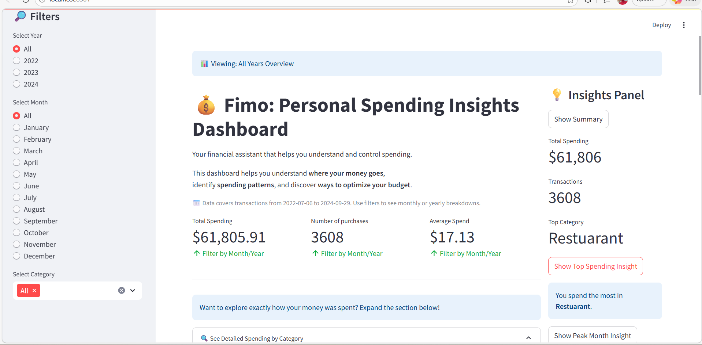
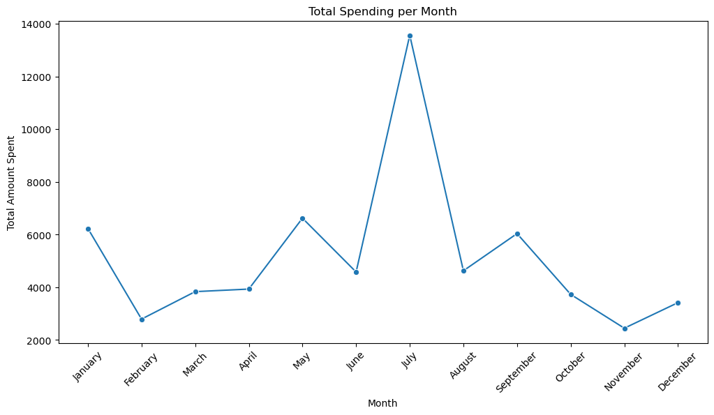

# 💰 Fimo: Personal Spending Insights Dashboard

## 📊 Overview
Fimo is an interactive **personal finance dashboard** built with **Streamlit** that helps users understand spending behavior, identify patterns, and make smarter financial decisions.

It transforms raw transaction data into **clear insights, trends, and actionable recommendations**.



## Introduction

Managing personal finances effectively is a critical skill for consumers. Understanding where money is spent, which expense areas dominate spending, and monthly trends can help individuals budget better, optimize expenses, and save for the future.

This project leverages a **Personal Budget Transactions dataset** containing transaction records of a consumer across 3 years (July 2022 to Sept 2024), including:

**date** – when purchases were made (date and time of purchase)

**category** – the type or purpose of spending (e.g., restaurants, coffee, groceries, travel)

**amount** – the cost of each purchase

The goal is to analyze **spending patterns** and generate actionable insights and recommendations, presented through an **interactive Streamlit dashboard.**

---

## 📊 Analysis process

The process and steps taken to generate insights:

**1. Dataset Inspection & Cleaning**
- Checked for missing values, duplicates, and inconsistent entries
- Converted transaction dates to proper datetime format
- Verified numeric fields for correct data types

**2. Feature Engineering**
- Extracted year, month, and weekday from transaction dates
- Created summary metrics such as total spending per month, per type, and number of transactions
- Added helper features to track trends and highlight top spending types
  
**3. Spending Analysis**
- Calculated total and average spend per type of expense
- Ranked expense types by total spending and number of transactions
- Identified peak spending periods (months/days)

**4. Insight Generation**
- Determined main spending drivers: transaction frequency vs. cost per transaction
- Noted seasonal trends, e.g., highest spending in July was travel-related expenses
- Generated actionable recommendations based on patterns

**5. Dashboard Development (Streamlit)**
- Built interactive KPI cards for total spend, number of transactions, and average amount spent
- Developed bar and line charts for monthly and weekday spending trends
- Created a dynamic insights panel for top spending type, peak month, and behavior insights
- Enabled progressive disclosure where users can explore insights step by step
- Implemented **interactive filters** for year and month after testing the initial prototype, which revealed that users felt overwhelmed when all data was shown at once. These filters give **users control** to focus on specific periods and explore trends relevant to their interests

---

## 🚀 Key Features

### 🔹 KPI Snapshot
- Total Spending  
- Number of Purchases  
- Average Spend  

> 💡 Instant overview of financial activity across selected filters

---

### 🔹 Category Insights
- Breakdown of spending by category  
- Highlights **top spending categories**  
- Shows **number of purchases per category**  

> 💡 Helps users identify where most of their money goes

---

### 🔹 Spending Trends
- Monthly spending patterns  
- Weekday spending behavior  

> 💡 Detect peak spending periods and habits

---

### 🔹 Smart Insights Panel
- Identifies **top spending categories**  
- Highlights **peak spending periods**  
- Provides **behavioral insights**  
- Recommends ways to reduce spending based on data shown  

---

## 📈 Example Insights

From the dataset:

- **Top Spending Category:** Restaurant (€10,425.60)  
- **High Frequency Categories:** Coffee (1043 transactions), Market (946 transactions)  
- **Insight:** Spending is driven more by **frequency of purchases** than high-value transactions
-  

### 💡 Recommendations
- Reduce frequent small purchases (coffee, eating out)  
- Plan ahead for high-spending months  
- Monitor categories with high transaction counts  

---

## 🧠 Business Value

This tool demonstrates how fintech platforms can:

- Provide **personalized spending insights** to users
- Help users **control recurring expenses**
- Improve **financial awareness and decision-making**
- Enable **data-driven financial coaching**

---

## 💡 Potential Use of Fimo (beyond the dataset)

Fimo is designed to be flexible for real-world use. Users can:  

- **Upload their own personal transaction data** in CSV format (with `date`, `category`, and `amount`) to analyze their own spending habits.  
- **Integrate with banking or financial APIs** in the future to automatically update dashboards with real-time spending.  
- **Use insights to plan budgets and savings**, e.g., identify frequent small purchases or high-spending months.  
- **Fintech applications:** Financial advisors or apps could leverage Fimo to provide personalized recommendations to clients, track spending behavior, or optimize recurring expenses.  

> 💡 This demonstrates that Fimo is not just a static dashboard. It is a **practical tool for personal financial management**, adaptable for different users and data sources.

---

## ⚙️ Tech Stack
- Python  
- Streamlit  
- Pandas  

---

## 📂 Project Structure
```
personal_spending_insights/
├── data/                # Contains datasets used for analysis
│   ├── budget_raw_data.csv               # original dataset from kaggle
│   └── budget_data_cleaned_features.csv  # pre-processed and feature engineered dataset   
│   └── monthly_insights.csv              # Additional analysis
      
├── images/              # Dashboard screenshots and plots
│   ├── budget_dashboard.png      # Overview of the interactive dashboard
│   └── monthly_spending.png              # Plot showing July as the highest spending month
├── .gitignore           
├── README.md            # Project documentation
├── budget_dashboard.py  # Main Streamlit application
└── requirements.txt     # Python dependencies
```
---

## ⚡ How to Run

1. Clone the repository:
```
git clone https://github.com/RitaAse/personal_spending_insights.git
cd personal_spending_insights
```


3. Install dependencies:
   ``` pip install -r requirements.txt ```


4. Run the app:
   ``` streamlit run budget_dashboard.py ```


## 👤 Author
**Rita Asemota**   
LinkedIn: [Rita Asemota](https://www.linkedin.com/in/rita-asemota-b7a666330/)
